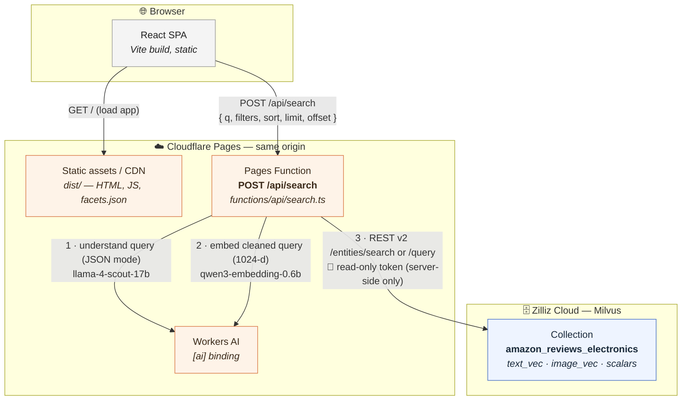
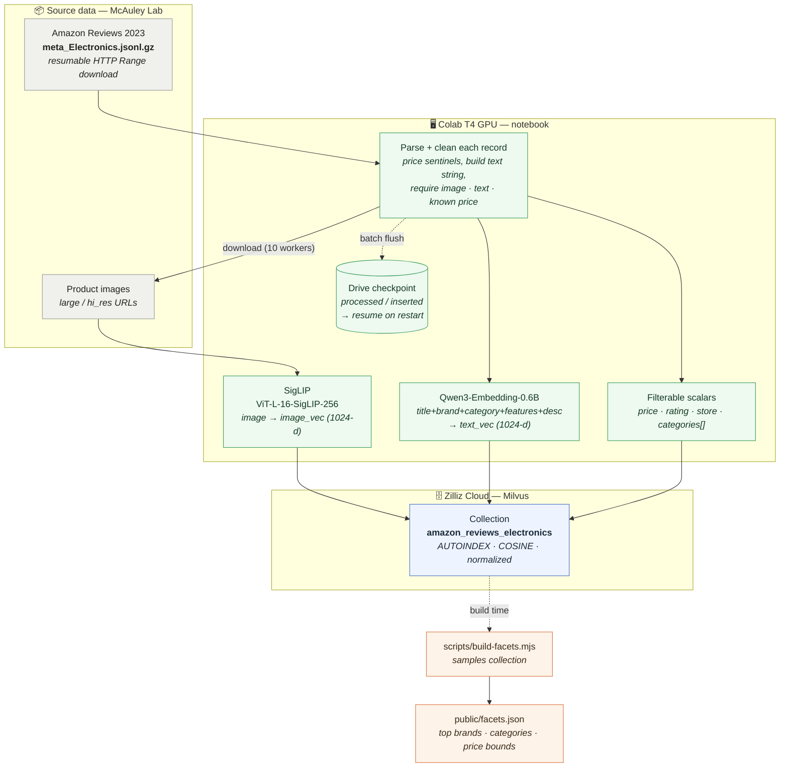

# Lumen — vector-search e-commerce demo

> [Live demo site](https://vdb-ecom.pages.dev/)

A minimalist, Amazon-style product search UI over an existing **Zilliz Cloud (Milvus)**
collection of Amazon electronics. Semantic search is powered by **Cloudflare Workers AI**
query embeddings; the catalog lives in Milvus. Built as a static React SPA on **Cloudflare
Pages** with a same-origin **Pages Function** proxy.

> The browser never sees the database key and never calls Zilliz directly. All DB access
> goes through `POST /api/search`, which holds the read-only key as a server-side secret.

## Architecture

The runtime is entirely on Cloudflare's edge: static assets and the API Function share one
origin, and the Function is the only thing that ever talks to Zilliz.



> The browser holds no secrets. The `ZILLIZ_TOKEN` lives only in the Function environment,
> so steps 1–3 all happen server-side at the edge.

- **Search** (`q` non-empty): embed the query, vector-search `text_vec` (COSINE).
- **Browse** (`q` empty): scalar query with the compiled filter.
- **Query understanding**: a NL query like *"remote control under $10"* is parsed by Workers
  AI (JSON mode) into a cleaned embedding query (*"remote control"*) plus implied numeric
  filters (*price ≤ $10*). The filter phrases are stripped before embedding, the implied
  filters are applied, and the interpretation is returned so the UI rewrites the search box
  and populates the filter rail. See [Query understanding](#query-understanding).
- **Filters** compile to a Milvus boolean expression (price, rating, reviews, brand,
  category) with user strings safely escaped.
- **Sort**: Relevance is native vector order; Price / Rating / Reviews re-rank the
  retrieved window client-side (standard vector-first approximation — it reorders the
  top-K, not the whole catalog).

## Prerequisites

- Node 20+ and npm.
- A **Cloudflare account** with Workers AI (the `[ai]` binding proxies to real Workers AI
  even in local dev, so it incurs usage charges). Authenticate once: `npx wrangler login`.
- A **Zilliz Cloud** cluster hosting the `amazon_reviews_electronics` collection, and a
  **read-only API key** (see [Security](#security)). The collection is built and ingested by
  this [data-generation notebook](amazon_reviews_ingest.ipynb)
  (embeds product text with Qwen3-Embedding-0.6B and images with SigLIP, then loads Milvus).

### Data-generation pipeline

The collection is a one-time offline build, separate from the runtime above. The notebook
runs on a Colab T4 GPU (image download is the bottleneck, not the GPU) and checkpoints to
Drive so the run is resumable.



> Each batch (`FETCH_BATCH=256`) downloads images, embeds text + images, and upserts in one
> flush, then advances the checkpoint — so an interrupted run resumes where it left off.
> `image_vec` is stored for the deferred "More like this" feature; the live app searches
> `text_vec` only.

## Setup

```bash
npm install
cp .dev.vars.example .dev.vars   # then fill in your Zilliz endpoint + read-only token
```

`.dev.vars` (gitignored) holds local secrets:

```
ZILLIZ_ENDPOINT=https://in03-xxxx.serverless.aws-eu-central-1.cloud.zilliz.com
ZILLIZ_TOKEN=<read-only key>
```

### Generate facet data

Facet controls (top brands, categories, price bounds) come from a build-time artifact, not
runtime distinct queries. Regenerate it from the live collection whenever the data changes:

```bash
npm run build:facets    # samples the collection -> public/facets.json
```

## Local development

```bash
npm run dev      # wrangler pages dev -- vite : SPA (HMR) + /api Function + AI binding
```

Open the printed URL. `npm run dev:vite` runs the UI alone (no `/api`, no bindings) for
pure styling work.

## Build & deploy

First, create the Pages project **once** — secrets and deploys both require it to exist:

```bash
npx wrangler pages project create vdb-ecom --production-branch main
```

Then set the production secrets (the project must already exist, or this errors with
`Project "vdb-ecom" does not exist`):

```bash
npx wrangler pages secret put ZILLIZ_ENDPOINT
npx wrangler pages secret put ZILLIZ_TOKEN
```

Build and deploy:

```bash
npm run deploy        # build + deploy to a preview (named after the current git branch)
npm run deploy:prod   # build + deploy to production (vdb-ecom.pages.dev)
```

`npm run deploy` creates a **preview** deployment at `<branch>.vdb-ecom.pages.dev`;
`npm run deploy:prod` (`wrangler pages deploy dist --branch main`) publishes to the production
URL `vdb-ecom.pages.dev`.

> Secrets are scoped per environment. `wrangler pages secret put NAME` targets **production**;
> add `--environment preview` to set them for preview deployments. Secret changes only take
> effect on the **next** deployment, so set secrets first, then deploy.

The Workers AI `[ai]` binding is declared in `wrangler.toml` and applies automatically. The
project name (`vdb-ecom`) comes from `wrangler.toml`; pass `--project-name` to override.
Git push-to-deploy also works once the Pages project is connected to the repo (set the same
two secrets in the dashboard).

## Security

- The Zilliz token is a **read-only** key — its role should be limited to **Search / Query /
  Describe** on this cluster and collection. Least privilege even though it's only ever used
  server-side.
- Secrets live only in the Function environment (`.dev.vars` locally, Pages secrets in prod)
  and are never committed or exposed to the browser.
- User-supplied filter strings (brand, category) are escaped before interpolation into the
  Milvus expression; the free-text query only drives the embedding, never the filter.

## STEP 0 — parity findings (verified live)

Before building, we confirmed the query embedding reproduces the collection's vector space:

- **Embedding dimension 1024** confirmed. Workers AI returns `{ shape, data }`; the vector
  is `res.data[0]`.
- **Query format chosen:** `{ queries: q, instruction: "Given a shopping query, retrieve
  relevant product listings" }` against `@cf/qwen/qwen3-embedding-0.6b`. The collection's
  documents were embedded plain (no instruction), and Qwen3-Embedding aligns
  instruction-prefixed queries with plain documents. Parity round-trip: **6/6 sample products
  self-matched at rank 1**, mean cosine **~0.87**; natural-language queries rank topically
  correct.
- **Zilliz REST v2:** search `POST {endpoint}/v2/vectordb/entities/search`
  (`data:[[…]]`, `annsField`, `filter`, `limit`, `offset`, `outputFields`); browse
  `…/entities/query` (`filter` may be `""`). Similarity is the `distance` field. Auth is
  `Authorization: Bearer <token>`. Serverless caps: `limit ≤ 1024`, `limit + offset < 16384`
  — the proxy clamps to these.

### Data note

Despite the ingest spec, `price` contains **`-1` sentinels** for unknown prices. The app
treats `price <= 0` as "no price": hidden on the card, excluded when a price filter is
active, and sorted last on price sorts.

## Query understanding

The proxy turns a natural-language query into a cleaned embedding text plus structured
filters, so phrases like "under $10" shape the *filter* instead of polluting the *embedding*.

- **How**: Workers AI in JSON mode (`@cf/meta/llama-4-scout-17b-16e-instruct`,
  `response_format: { type: "json_schema", ... }`) extracts `{ cleaned_query, price_min,
  price_max, min_rating, min_reviews }`. A deterministic regex backstop (`backstopFilters`)
  fills any explicit `$N` / `N star` / `N reviews` the model misses and recovers filters if
  the model call fails. The proxy embeds `cleaned_query`, applies `UI filters ∪ implied
  filters`, and returns the interpretation in `parsed`.
- **Scope**: numeric constraints only (price / rating / reviews). Brand and category stay on
  the manual controls — extracting them reliably needs the facet lists injected into the
  prompt and risks hallucinated values. Vague terms ("cheap") are intentionally *not* guessed.
- **UI**: the client sends `understand: true` only when the query *text* changes (not on
  filter/sort/page changes), then rewrites the search box to the cleaned text, merges implied
  filters into the rail, and shows a dismissible interpretation note. The cleaned text
  re-parses to nothing, so this converges without a loop.
- **UX**: search is submit-driven (Enter or the Search button), not as-you-type — the
  understanding model only runs when the committed query text changes. Submitting a new query
  clears the filter rail first so the prior query's implied filters don't carry over.
- **Resilience**: understanding is best-effort and wrapped in try/catch — if the model call
  fails, the regex backstop and raw query are used so the search still returns. Latency is
  visible in the diagnostics panel (`understand` timing); typical ~0.6–1 s with Llama 4 Scout.

> Model note: Llama 4 Scout handles ranges and multi-constraint queries correctly at ~0.6–1s.
> Several older models (`llama-3.1-8b-instruct`, `llama-3-8b-instruct`, `hermes-2-pro`,
> `mistral-7b`) were deprecated 2026-05-30; `llama-3.3-70b-instruct-fp8-fast` is accurate but
> far too slow (~60s); smaller models dropped constraints on ranges.

## Project layout

| Path | Purpose |
| --- | --- |
| `functions/api/search.ts` | Pages Function proxy: embed + search/browse, filter compile, sort, clamp |
| `src/lib/searchClient.ts` | Single front-end DB seam (calls `/api/search`) |
| `src/lib/types.ts` | Shared request/response contract |
| `scripts/build-facets.mjs` | Samples the collection → `public/facets.json` |
| `src/components/` | UI: header, filter panel, product grid/card, pagination, states |
| `wrangler.toml` | `[ai]` binding + Pages output dir |

## Not built (deferred)

"More like this" (`POST /api/similar`) — search-by-stored-PK (`ids`) on `image_vec` /
`text_vec`. A seam is left in `src/lib/searchClient.ts`.
